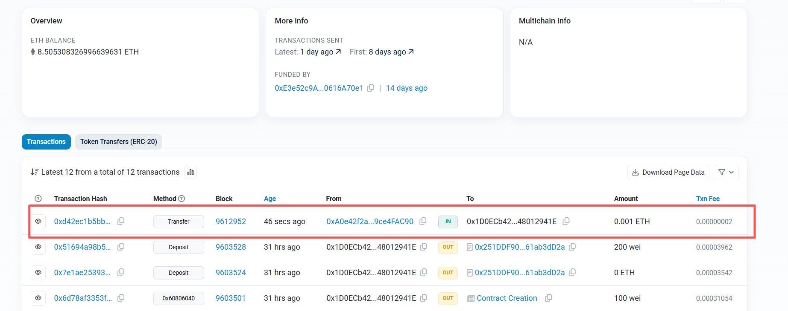

# 任务 1：区块链读写 任务目标
使用 Sepolia 测试网络实现基础的区块链交互，包括查询区块和发送交易。
具体任务
## 环境搭建
安装必要的开发工具，如 Go 语言环境、 go-ethereum 库。
注册 Infura 账户，获取 Sepolia 测试网络的 API Key。
## 查询区块
编写 Go 代码，使用 ethclient 连接到 Sepolia 测试网络。
实现查询指定区块号的区块信息，包括区块的哈希、时间戳、交易数量等。
输出查询结果到控制台。
## 发送交易
准备一个 Sepolia 测试网络的以太坊账户，并获取其私钥。
编写 Go 代码，使用 ethclient 连接到 Sepolia 测试网络。
构造一笔简单的以太币转账交易，指定发送方、接收方和转账金额。
对交易进行签名，并将签名后的交易发送到网络。
输出交易的哈希值。

# 任务 2：合约代码生成 任务目标
使用 abigen 工具自动生成 Go 绑定代码，用于与 Sepolia 测试网络上的智能合约进行交互。
具体任务
## 编写智能合约
使用 Solidity 编写一个简单的智能合约，例如一个计数器合约。
编译智能合约，生成 ABI 和字节码文件。
## 使用 abigen 生成 Go 绑定代码
安装 abigen 工具。
使用 abigen 工具根据 ABI 和字节码文件生成 Go 绑定代码。
## 使用生成的 Go 绑定代码与合约交互
编写 Go 代码，使用生成的 Go 绑定代码连接到 Sepolia 测试网络上的智能合约。
调用合约的方法，例如增加计数器的值。
输出调用结果。

转账成功截图
