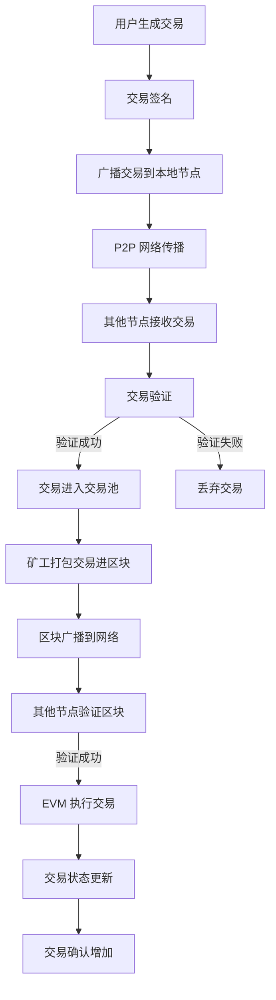

```mermaid
flowchart TD
    A[用户生成交易] --> B[交易签名]
    B --> C[广播交易到本地节点]
    C --> D[P2P 网络传播]
    D --> E[其他节点接收交易]
    E --> F[交易验证]
    F -->|验证成功| G[交易进入交易池]
    F -->|验证失败| H[丢弃交易]
    G --> I[矿工打包交易进区块]
    I --> J[区块广播到网络]
    J --> K[其他节点验证区块]
    K -->|验证成功| L[EVM 执行交易]
    L --> M[交易状态更新]
    M --> N[交易确认增加]
```